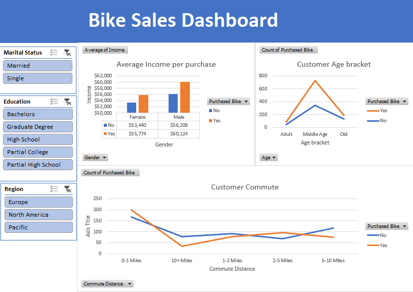

# Bike-Sales-Analysis-Dashboard
An interactive Excel dashboard analyzing customer purchase behavior

## 📊 Dashboard Preview

## 🛠️ Data Process
* **Data Cleaning:** Handled duplicates and standardized values for 'Commute Distance' and 'Age'.
* **Data Transformation:** Created age brackets (Adult, Middle Age, Old) to better categorize customers.
* **Pivot Tables:** Summarized average income per purchase and count of sales by region.

## 💡 Key Insights
* Customers commuting **0-5 miles** are the most likely to purchase a bike.
* Higher income levels correlate with a higher probability of purchase.
* The **Pacific** region shows the highest conversion rate at nearly 59%.
